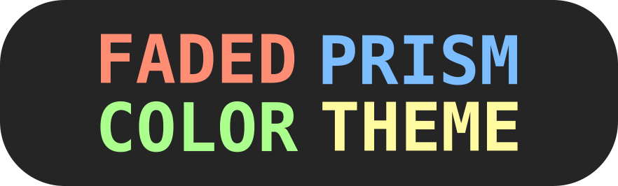

A pastel color theme by Ryan Brue! Works great with all sorts of languages!

## Motivation

I really like the One Dark Pro theme, but I felt like the colors were switched from what I would expect for each type of symbol. I felt like this coloring made more sense to me:

- Red for keywords
- Yellow for strings
- Green for functions
- Blue for types and classes

Using this simple framework, the rest of the features came naturally.

## In all your favorite editors

- [VSCode](https://marketplace.visualstudio.com/items?itemName=ryanabx.faded-prism-theme)
- [VSCodium](https://open-vsx.org/extension/ryanabx/faded-prism-theme)
- Lapce (WIP)
- Helix (WIP)

## Contributing

If you'd like to make sure colors in your language of choice are properly defined, please make a PR!